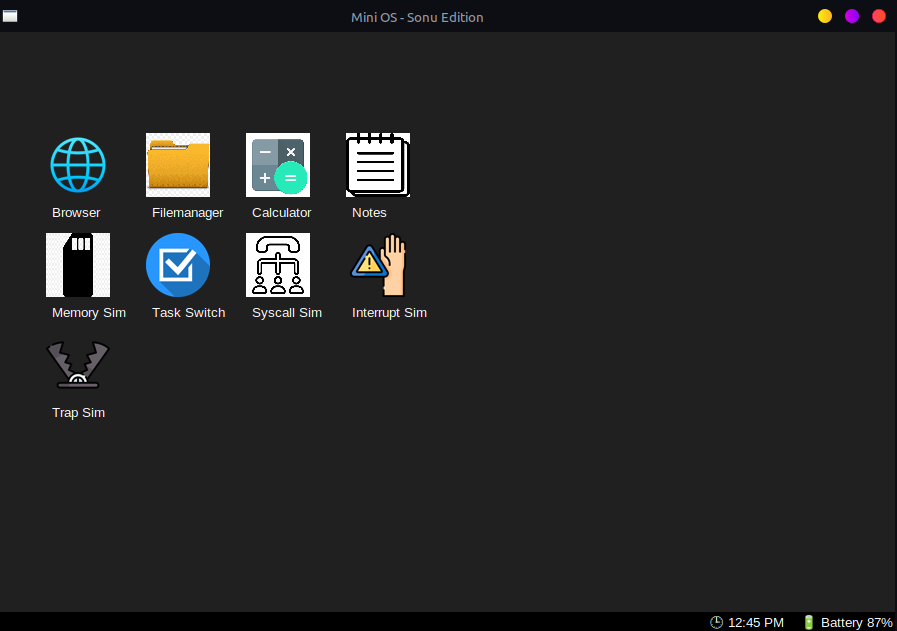

# Mini Operating System Project



## 🔥 Project Summary

This project is a **Mini Operating System simulation**, developed in multiple phases. It starts from a basic bootloader and gradually builds up to a functional graphical interface written in Python. This educational OS showcases key concepts of operating system design such as memory management, task switching, interrupts, system calls, and ends with a simulated GUI OS with built-in applications.

---

## 📁 Project Structure
mini-os-sonu/

├── README.md

├── os.png

└── phase1/  # Bootloader

    ├── bootloader.asm
    ├── os_image.bin
    └── run.sh

└── phase2/               # Memory Management

    ├── Makefile
    ├── memory_manager.c
    ├── memory_manager
    ├── memory_sim.c
    └── memory_sim

└── phase3/               # Task Switching

    ├── Makefile
    ├── task_switch.c
    └── task_switch

└── phase4/               # System Calls

    ├── Makefile
    ├── syscall_sim.c
    └── syscall_sim

└── phase5/               # Interrupt & Trap

    ├── Makefile
    ├── interrupt.asm
    ├── interrupt.c
    ├── interrupt.o
    ├── interrupt_sim
    ├── trap_sim.asm
    ├── trap_sim.c
    ├── trap_c.o
    ├── trap_sim.o
    └── trap_sim

└── phase6/               # GUI-based OS (Python + Tkinter)

    ├── os_gui.py
    ├── apps/
    │   ├── browser_sim.py
    │   ├── calculator.py
    │   ├── command_prompt.py
    │   ├── filemanager.py
    │   ├── notes_app.py
    │   └── __pycache__/
    └── icons/
        ├── browser.png
        ├── calculator.png
        ├── filemanager.png
        ├── interrupt.png
        ├── memory.png
        ├── notes.png
        ├── syscall.png
        ├── task.png
        └── trap.png


---

## 🧠 Phase-wise Description

### 🟢 Phase 1 – Bootloader
- `bootloader.asm` written in x86 assembly
- `run.sh` to compile and run bootloader using QEMU
- Output: `os_image.bin`

### 🔵 Phase 2 – Memory Manager
- Simulated memory allocator (`memory_manager.c`)
- CLI interaction to simulate memory allocation and deallocation

### 🟣 Phase 3 – Task Switching
- Simple multitasking simulation in C
- Understands context switch mechanism

### 🟡 Phase 4 – System Calls
- Simulates syscall mechanism in user-kernel model

### 🔴 Phase 5 – Interrupt and Trap
- Combines C and ASM to demonstrate interrupt handling

### 🟠 Phase 6 – GUI Operating System
- `os_gui.py`: Main OS launcher (Python + Tkinter)
- **Applications**:
  - 📁 File Manager
  - 📝 Notes App
  - 🔢 Calculator
  - 🌐 Browser Simulator
  - 💻 Command Prompt

---
📦 Requirements

python>=3.10
tk
---


## 💻 How to Run (GUI OS)

```bash
cd phase6
python3 os_gui.py

